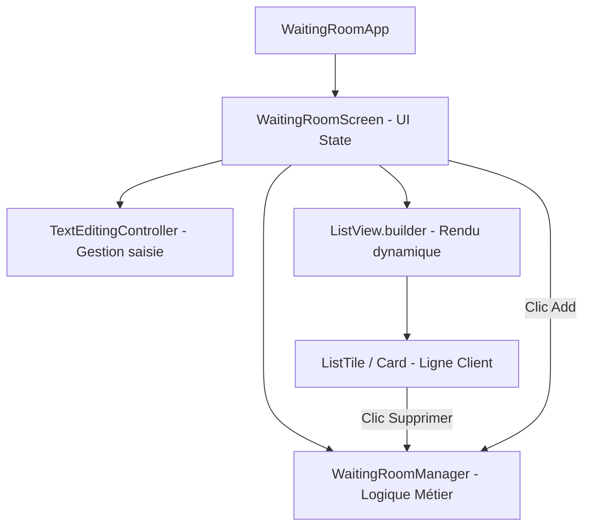

# 📚 Documentation Technique - Waiting Room App

Bienvenue dans la documentation complète de l'application **Waiting Room App** (Gestion de Salle d'Attente). Ce document détaille le fonctionnement général, l'interface utilisateur, la liste de tous les boutons et actions, l'architecture logicielle, ainsi qu'une explication ligne par ligne des extraits de code essentiels.

---

## 📋 Table des Matières
1. [🌟 Présentation Générale](#-présentation-générale)
2. [🖥️ Description du Contenu et de l'Interface Utilisateur](#️-description-du-contenu-et-de-linterface-utilisateur)
3. [🔘 Description des Boutons et Actions](#-description-des-boutons-et-actions)
4. [🧠 Logique Métier et Architecture du Code](#-logique-métier-et-architecture-du-code)
5. [🔍 Analyse Détaillée des Bouts de Code Importants (Ligne par Ligne)](#-analyse-détaillée-des-bouts-de-code-importants-ligne-par-ligne)
   - [1. Gestionnaire d'état métier : `WaitingRoomManager`](#1-gestionnaire-détat-métier--waitingroommanager)
   - [2. Logique d'ajout d'un client : `_addClient`](#2-logique-dajout-dun-client--_addclient)
   - [3. Construction réactive de la liste : `ListView.builder`](#3-construction-réactive-de-la-liste--listviewbuilder)
   - [4. Horloge dynamique en temps réel : `WaitingRoomTimestamp`](#4-horloge-dynamique-en-temps-réel--waitingroomtimestamp)
   - [5. Carte client réutilisable : `WaitingRoomCard`](#5-carte-client-réutilisable--waitingroomcard)
6. [🚀 Guide d'Exécution et Tests](#-guide-dexécution-et-tests)

---

## 🌟 Présentation Générale

**Waiting Room App** est une application multiplateforme (Web, Android, iOS, Windows, macOS, Linux) développée avec le framework **Flutter** en langage **Dart**.

### Objectif principal :
Permettre la gestion dynamique et en temps réel d'une file d'attente (salle d'attente locale pour cabinet médical, guichet, service client, etc.) :
- **Ajouter** un client/patient dans la file d'attente.
- **Visualiser** instantanément le nombre de personnes en attente et leur ordre d'arrivée.
- **Supprimer** un client lorsque sa consultation ou son traitement est terminé.
- **Afficher** des cartes personnalisées avec horodatage en direct.

---

## 🖥️ Description du Contenu et de l'Interface Utilisateur

L'interface principale (`WaitingRoomScreen`) est organisée de manière intuitive et ergonomique :

```
+-------------------------------------------------------------+
|  [AppBar] 🏨 Local Waiting Room                            |
+-------------------------------------------------------------+
|                                                             |
|  [TextField: "Client Name"]          [Button: "Add"]        |
|                                                             |
|  👥 Clients in Queue: 3                                     |
|                                                             |
|  +-------------------------------------------------------+  |
|  | 👤 Alice                             [ 🗑️ Supprimer ] |  |
|  +-------------------------------------------------------+  |
|  | 👤 Bob                               [ 🗑️ Supprimer ] |  |
|  +-------------------------------------------------------+  |
|  | 👤 Charlie                           [ 🗑️ Supprimer ] |  |
|  +-------------------------------------------------------+  |
|                                                             |
+-------------------------------------------------------------+
```

### Éléments clés de l'interface :
1. **Barre de titre (AppBar)** : En haut de l'écran, avec un fond couleur Indigo et le titre *"Local Waiting Room"*.
2. **Zone de saisie (TextField)** : Champ de formulaire avec label flottant *"Client Name"* et bordure arrondie pour taper le nom du nouveau client.
3. **Compteur dynamique (`Clients in Queue: X`)** : Texte mis à jour en direct indiquant le nombre total d'attentes.
4. **Liste déroulante (ListView)** : Affiche chaque client sous forme d'une carte (`Card`) stylisée contenant :
   - Une icône utilisateur (`Icons.person`)
   - Le nom du client
   - Un bouton d'action contextuel pour retirer le client.

---

## 🔘 Description des Boutons et Actions

| Bouton / Déclencheur | Type de Widget | Action Réalisée |
| :--- | :--- | :--- |
| **Bouton `Add`** | `ElevatedButton` | Récupère le texte saisi, vérifie qu'il n'est pas vide, ajoute le client à la liste via `WaitingRoomManager`, réinitialise le champ de texte et rafraîchit l'interface utilisateur. |
| **Touche Entrée (`onSubmitted`)** | Événement du `TextField` | Permet d'ajouter directement le client en appuyant sur la touche *Entrée* du clavier physique ou virtuel, sans avoir à cliquer sur le bouton *Add*. |
| **Icône Poubelle (`Remove client`)** | `IconButton` (`Icons.delete`) | Supprime le client sélectionné de la liste gérée par `WaitingRoomManager` et met à jour instantanément la liste et le compteur. |

---

## 🧠 Logique Métier et Architecture du Code

Le projet adopte une séparation claire des responsabilités :



1. **Couche Métier (`WaitingRoomManager`)** :
   - Encapsule la liste des clients dans une variable privée `_clients`.
   - Fournit des méthodes propres pour ajouter (`addClient`) et supprimer (`removeClient`).
2. **Couche Présentation & État (`_WaitingRoomScreenState`)** :
   - Utilise un `StatefulWidget` pour gérer les états changeants de la vue.
   - Les appels à `setState()` déclenchent la reconstruction automatique des widgets impactés (compteur et liste).
   - Nettoyage rigoureux des ressources via `dispose()`.
3. **Composants Réutilisables & Modulaires** :
   - `WaitingRoomCard` : Carte d'affichage client individuelle.
   - `WaitingRoomTimestamp` : Widget avec timer d'une seconde rafraîchissant l'heure actuelle.

---

## 🔍 Analyse Détaillée des Bouts de Code Importants (Ligne par Ligne)

### 1. Gestionnaire d'état métier : `WaitingRoomManager`
📄 **Fichier :** `lib/waiting_room_manager.dart`

```dart
class WaitingRoomManager {
  final List<String> _clients = [];
  List<String> get clients => _clients;

  void addClient(String name) {
    _clients.add(name);
  }

  void removeClient(String name) {
    _clients.remove(name);
  }
}
```

#### 📝 Explication ligne par ligne :
- **Ligne 1 : `class WaitingRoomManager {`**
  - Déclare la classe responsable de la gestion des données de la salle d'attente (pattern Service/Manager).
- **Ligne 2 : `final List<String> _clients = [];`**
  - Déclare une liste privée (commençant par `_`) stockant les chaînes de caractères (noms des clients). Le mot-clé `final` garantit que la référence de la liste ne sera pas réassignée.
- **Ligne 3 : `List<String> get clients => _clients;`**
  - Définit un *getter* public permettant d'accéder à la liste en lecture seule depuis l'extérieur, respectant le principe d'encapsulation.
- **Ligne 6-8 : `void addClient(String name) { _clients.add(name); }`**
  - Méthode prenant en paramètre le nom du client et l'ajoutant à la fin de la file d'attente grâce à `_clients.add(name)`.
- **Ligne 10-12 : `void removeClient(String name) { _clients.remove(name); }`**
  - Méthode permettant de retirer la première occurrence correspondante au nom passé en paramètre.

---

### 2. Logique d'ajout d'un client : `_addClient`
📄 **Fichier :** `lib/main.dart` (Lignes 37 à 46)

```dart
void _addClient() {
  final name = _controller.text.trim();

  if (name.isNotEmpty) {
    setState(() {
      _manager.addClient(name);
      _controller.clear();
    });
  }
}
```

#### 📝 Explication ligne par ligne :
- **Ligne 37 : `void _addClient() {`**
  - Définition de la fonction interne appelée lors de l'ajout d'un nouveau client.
- **Ligne 38 : `final name = _controller.text.trim();`**
  - Récupère la chaîne saisie dans le `TextField` via le `TextEditingController` et applique `.trim()` pour supprimer les espaces inutiles au début et à la fin.
- **Ligne 40 : `if (name.isNotEmpty) {`**
  - Condition de garde évitant d'ajouter des clients avec un nom vide dans la liste.
- **Ligne 41 : `setState(() {`**
  - Notifie le framework Flutter que l'état interne a changé et demande une reconstruction du widget.
- **Ligne 42 : `_manager.addClient(name);`**
  - Appelle la méthode métier pour insérer le nom dans la liste des clients.
- **Ligne 43 : `_controller.clear();`**
  - Efface le texte du champ de saisie afin de le laisser prêt pour la saisie suivante.

---

### 3. Construction réactive de la liste : `ListView.builder`
📄 **Fichier :** `lib/main.dart` (Lignes 106 à 140)

```dart
Expanded(
  child: ListView.builder(
    itemCount: _manager.clients.length,
    itemBuilder: (context, index) {
      final clientName = _manager.clients[index];

      return Card(
        child: ListTile(
          leading: const Icon(
            Icons.person,
            color: Colors.indigo,
          ),
          title: Text(clientName),
          trailing: IconButton(
            icon: const Icon(
              Icons.delete,
              color: Colors.red,
            ),
            tooltip: 'Remove client',
            onPressed: () {
              setState(() {
                _manager.removeClient(clientName);
              });
            },
          ),
        ),
      );
    },
  ),
),
```

#### 📝 Explication ligne par ligne :
- **Ligne 106 : `Expanded(`**
  - Permet à la `ListView` d'occuper tout l'espace vertical disponible restant dans la `Column`.
- **Ligne 107 : `child: ListView.builder(`**
  - Crée une liste performante qui ne génère à l'écran que les éléments actuellement visibles (chargement paresseux / lazy loading).
- **Ligne 108 : `itemCount: _manager.clients.length,`**
  - Indique à la liste le nombre total d'éléments à afficher.
- **Ligne 110 : `itemBuilder: (context, index) {`**
  - Fonction de rappel (callback) appelée pour construire chaque ligne selon son index.
- **Ligne 111 : `final clientName = _manager.clients[index];`**
  - Récupère le nom du client correspondant à la position `index`.
- **Ligne 113-114 : `return Card( child: ListTile(`**
  - Enveloppe chaque élément dans un composant `Card` avec un layout standardisé `ListTile`.
- **Ligne 115-118 : `leading: const Icon(Icons.person, color: Colors.indigo),`**
  - Place une icône de profil couleur indigo au début de la ligne.
- **Ligne 120 : `title: Text(clientName),`**
  - Affiche le nom du client en tant que titre principal.
- **Ligne 122-135 : `trailing: IconButton(...)`**
  - Place un bouton d'action à droite avec une icône de poubelle rouge.
- **Ligne 130-134 : `onPressed: () { setState(() { _manager.removeClient(clientName); }); }`**
  - Lors du clic, supprime le client du manager et actualise la vue via `setState()`.

---

### 4. Horloge dynamique en temps réel : `WaitingRoomTimestamp`
📄 **Fichier :** `lib/waiting_room_timestamp.dart`

```dart
class _WaitingRoomTimestampState extends State<WaitingRoomTimestamp> {
  late DateTime _currentTime;
  late Timer _timer;

  @override
  void initState() {
    super.initState();
    _currentTime = DateTime.now();
    _timer = Timer.periodic(
      const Duration(seconds: 1),
      (timer) {
        setState(() {
          _currentTime = DateTime.now();
        });
      },
    );
  }

  @override
  void dispose() {
    _timer.cancel();
    super.dispose();
  }

  @override
  Widget build(BuildContext context) {
    final formattedTime = _currentTime.toString().split('.')[0];
    return Text(
      'Current Time: $formattedTime',
      style: const TextStyle(fontSize: 14, color: Colors.black54),
    );
  }
}
```

#### 📝 Explication ligne par ligne :
- **Ligne 13-14 : `late DateTime _currentTime; late Timer _timer;`**
  - Déclare la date courante et le minuteur qui seront initialisés dans `initState()`.
- **Ligne 17-20 : `void initState() { super.initState(); _currentTime = DateTime.now();`**
  - Méthode du cycle de vie appelée à la création du widget : initialise l'heure avec l'instant présent.
- **Ligne 22-29 : `_timer = Timer.periodic(const Duration(seconds: 1), (timer) { ... });`**
  - Configure un minuteur récurrent qui s'exécute toutes les secondes pour actualiser `_currentTime` et rafraîchir l'affichage via `setState`.
- **Ligne 33-36 : `void dispose() { _timer.cancel(); super.dispose(); }`**
  - **Essentiel :** Annule le minuteur lors de la destruction du composant pour éviter les fuites de mémoire (*memory leaks*).
- **Ligne 40 : `final formattedTime = _currentTime.toString().split('.')[0];`**
  - Formate la date pour ne conserver que `YYYY-MM-DD HH:MM:SS` en éliminant les microsecondes.

---

### 5. Carte client réutilisable : `WaitingRoomCard`
📄 **Fichier :** `lib/waiting_room_card.dart`

```dart
class WaitingRoomCard extends StatelessWidget {
  final String name;

  const WaitingRoomCard({
    super.key,
    required this.name,
  });

  @override
  Widget build(BuildContext context) {
    return Card(
      margin: const EdgeInsets.all(16.0),
      child: Padding(
        padding: const EdgeInsets.all(24.0),
        child: Column(
          mainAxisSize: MainAxisSize.min,
          children: [
            const Text('Hello,', style: TextStyle(fontSize: 16)),
            Text(
              name,
              style: const TextStyle(fontSize: 24, fontWeight: FontWeight.bold),
            ),
            const SizedBox(height: 10),
            const WaitingRoomTimestamp(),
          ],
        ),
      ),
    );
  }
}
```

#### 📝 Explication ligne par ligne :
- **Ligne 4-5 : `class WaitingRoomCard extends StatelessWidget { final String name;`**
  - Widget sans état (`StatelessWidget`) qui reçoit le nom d'un client en paramètre immuable.
- **Ligne 7-10 : `const WaitingRoomCard({ super.key, required this.name });`**
  - Constructeur constant exigeant obligatoirement la propriété `name`.
- **Ligne 14-17 : `return Card( ... child: Padding(`**
  - Utilise une carte visuelle avec bordures et ombre portée, complétée par une marge interne de 24 pixels.
- **Ligne 18-20 : `child: Column( mainAxisSize: MainAxisSize.min,`**
  - Organise les éléments verticalement en s'adaptant à la taille minimale requise par ses enfants.
- **Ligne 21-34 : Affichage du message, du nom en gras et intégration du composant d'horodatage `WaitingRoomTimestamp()`.**

---

## 🚀 Guide d'Exécution et Tests

### Prérequis
- Flutter SDK (version 3.x ou supérieure)
- Dart SDK

### Commandes utiles

```bash
# 1. Télécharger les dépendances
flutter pub get

# 2. Lancer l'application (sur Chrome / Web ou Émulateur)
flutter run

# 3. Lancer la suite de tests unitaires et de widgets
flutter test
```

---

*Documentation générée pour le projet **Waiting Room App** - Prête pour intégration sur GitHub.*
